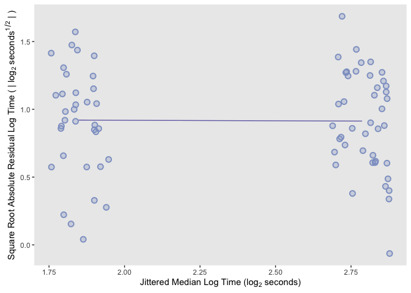
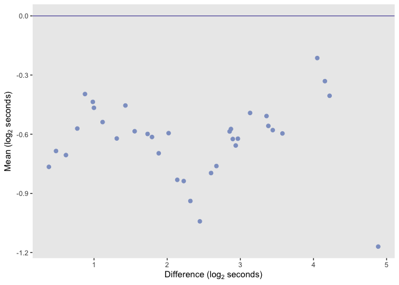
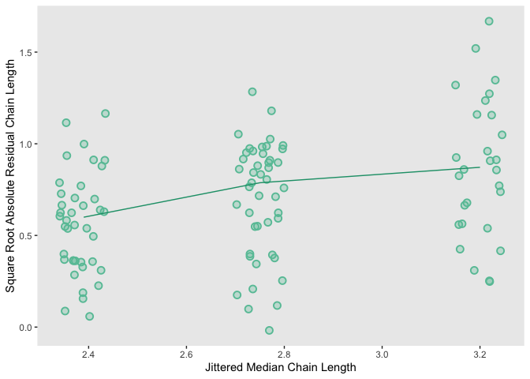

Reproducing figures in Cleveland’s **Visualizing Data**
================
Shanti Agung
5/1/2020

 

-----

# **Chapter 1** Introduction

 

  

  

**Figure 1.3** An exploratory scatterplot graphs the Babinet point
against particulate
concentration.

  

**Figure 1.4** Oxides of nitrogen are graphed against equivalent
ratio.

  

**Figure 1.5** Oxides of nitrogen are graphed against compression ratio.

  

 

-----

# **Chapter 2** Univariate Data

 

  

**Figure 2.2** The symbols and the line segments show the quantile
function of the first tenor
heights

  

**Figure 2.3** The first tenor and second bass height distributions are
compared by a q-q
plot

  

**Figure 2.4** The first tenor and second bass height distributions are
compared by a Tukey m-d
plot

  

**Figure 2.8** The eight singer distribution are compared by box plots

  

  

**Figure 2.12** A dot plot displays the sample means of the height
distributions

  

**Figure 2.13** Box plots compare the distributions of the height
residuals for the fit to the data by voice-part means

  

  

**Figure 2.15** The pooled residuals are displayed by a quantile
plot

  

**Figure 2.16** A normal q-q plot compares the distribution of the
pooled residuals with a normal
distribution

  

**Figure 2.17** An r-f spread plot compares the spreads of the residuals
and the fitted values minus their mean for the fit to the singer data

  

  

  

**Figure 2.23** The distributions of the fusion times are compared by
box plots

  

  

**Figure 2.25** The s-l plot for the fusion times checks for nonuniform
spread

  

**Figure 2.26** The s-l plot for the log fusion times checks for
nonuniform
spread

  

**Figure 2.27** The q-q plot compares the distributions of the fusion
times

  

**Figure 2.28** The q-q plot compares the distributions of the log
fusion
times

  

**Figure 2.29** The m-d plot provides more information about the shift
of the log fusion times

  

  

**Figure 2.31** A normal q-q plot compares the normal distribution with
the distribution of the pooled residuals for the fit to log fusion
time

  

**Figure 2.32** An r-f spread plot compares the spreads of the residuals
and the fitted values minus their mean for the fit to log fusion time

  

  

  

**Figure 2.35** The s-l plot for the chain lengths checks for nonuniform
spread

  

  

**Figure 2.37** The s-l plot for the log chain lengths checks for
nonuniform spread

  

  

  

**Figure 2.39** The s-l plot for the inverse chain lengths, or link
fractions, checks for nonuniform spread

  

  

  

**Figure 2.42** An r-f spread plot compares the spreads of the residuals
and the fitted values minus their mean for the fit to the link
fraction

  

**Figure 2.43** Box plots compare the distributions of the bin packing
data

  

**Figure D-2.43** Violin plots compare the distributions of the bin
packing data

  

  

  

  

**Figure 2.47** The normal q-q plot compares the normal distribution
with the distribution of te pooled spread-standardized residuals for
seven values of
*n*

  

**Figure 2.48** Median log empty space is graphed against log number of
weights

  

**Figure 2.49** The logs of the mads for log empty space are graphed
against log number of
weights

  

**Figure 2.50** Log relative mads for log empty space are graphed
against median log empty
space

  

**Figure 2.51** Log relative mads for empty space are graphed against
median empty space

  

  

  

-----

# **Chapter 3** Bivariate Data

 

**Figure 3.1** A scatterplot displays bivariate data: measurements of
retinal area and CP ratio for 14 cat
fetuses

  

**Figure 3.2** A loess curve has been added to the scatterplot of the
ganglion data. The aspect ratio of the graph has been chosen to bank the
curve to 45
degree

  

**Figure 3.4** The least-squares line has been added to the scatterplot
of the ganglion
data

  

**Figure 3.5** The least-squares fit of a quadratic polynomial has been
added to the scatterplot of the ganglion data. The curve is banked to 45
degree

  

**Figure 3.6** The data are fitted by loess. The curve is banked to 45
degree

  

**Figure 3.9** The three loess curves have three different values of the
smoothing parameter, \(\alpha\). From the bottom panel to the top the
values are 0.1, 0.3, and 0.6. The value of \(\lambda\) is
2.

  

**Figure 3.10** The three loess fits are shown. From the bottom panel to
the top the parameters, \(\alpha\) and \(\lambda\), are the following:
0.1 and 1; 0.3 and 1; 0.3 and
2

  

**Figure 3.12** On this residual dependence plot, the residuals from the
linear fit to CP ratio are graphed against area. The parameters of the
loess curve on the plot are \(\alpha\) = 1 and \(\lambda\) =
1

  

**Figure 3.13** On this residual dependence plot, the residuals from the
quadratic fit to CP ratio are graphed against area. The parameters of
the loess curve on the plot are \(\alpha\) = 1 and \(\lambda\) =
1

  

**Figure 3.14** On this s-l plot, the square root absolute residuals
from the quadratic fit to CP ratio are graphed against the fitted values
to check for monotone spread. The parameters of the loess curve on the
plot are \(\alpha\) = 2 and \(\lambda\) =
1

  

**Figure 3.15** Log CP ratio is graphed against area. The curve is a
loess fit with \(\alpha\) = 2/3 and \(\lambda\) =
1

  

**Figure 3.16** Log CP ratio is graphed against area. The curve is the
least-squares
fit

  

**Figure 3.17** On this residual dependence plot, the residuals from the
linear fit to log CP ratio are graphed against area. The parameters of
the loess curve on the plot are \(\alpha = 1\) and \(\lambda\) =
1

  

**Figure 3.18** An s-l plot for the linear fit to log CP ratio checks
for monotone spread. The parameters of the loess curve are \(\alpha\) =
2 and \(\lambda\) =
1

  

**Figure 3.19** An r-f spread plot compares the spreads of the residuals
and the fitted values minus their mean for the linear fit to log CP
ratio

  

**Figure 3.20** A normal q-q plot compares the normal distribution with
the distribution of the residuals for the linear fit to log CP
ratio

  

  

**Figure 3.21** The differences of carbon age and thorium age for 19
coral samples are graphed against the carbon
ages

  

**Figure 3.22** The least-squares fit of a line has been added to the
scatterplot of the dating
data

  

**Figure 3.23** The residuals from the least-squares fit to the dating
data are graphed against carbon
age

  

**Figure 3.25** The bisquare fit of a line has been added to the
scatterplot of the dating data

